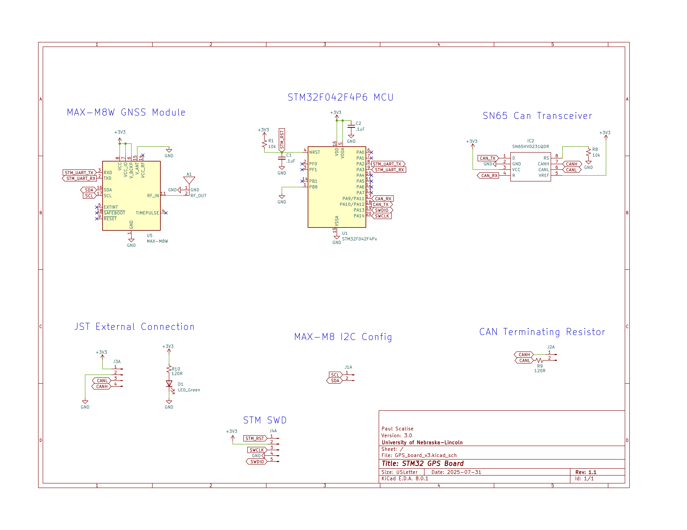

# GPS Board v3.0 r1.1

This board was designed for ECEN-435 at the University of Nebraska-Lincoln (Scott Campus).

## Connections

## Board

## Issues and Troubleshooting
Testing is underway with more updates to come.
